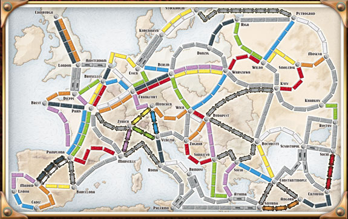

# Ticket To Ride

Ticket to Ride is a turn-based board game based on a graph theory. Players operate on undirected
graph of cities and train connections. On each turn, player buys ability
to color one edge of the graph with his color. Each player has number of tickets - each ticket
consists of two cities the playes has to connect. The goal is to create a subset graph (defined by
player color) which will contain both of the cities from the ticket in a single connected subgraph.

## Assignment 
Your goal is to write program that will calculate some data for the Ticket To Ride board. In the
repository you'll find two datasets - simple small dataset and real board from Ticket to Ride
Europe. Also visualisations for them are included.

[Sample Data Set](data_sample.txt) | [Visualization](data_sample.png)
[TTR Europe](data_ttr_europe.txt) | [Visualization](data_ttr_europe.png)

Each file consists of lines, in each line there is single edge defined. Each edge consists of start
city, end city and cost of building connection between these cities.

### Task 1
Write a function `number_of_cities(graph)` that will return number of cities in the given graph

### Task 2
Write a function that `with_single_change(graph, start_node)` will return alphabetically sorted list
of all the cities that are available within two changes. For example, assuming variable `g` holds
graph representation of Europe map, `with_single_change(g, "Edinburgh")` should return `["Amsterdam",
"Dieppe", "Edinburgh", "London"]`.

### Task 3
Based on solution for `with_single_change`, write function `with_n_changes(graph, start_node, n)`
that will return all the nodes that are accessable with at most n changes.

### Task 4
Write function `farthest_city_by_changes(graph, start_node)` that will return the city that requires
most changes to get to it (using optimal number of changes). The result should be tupple of distance
and city name, for example `(8, "Budapest")`

### Task 5
Write a function `distance(graph, start_node, end_node) that will return minimal distance between
two nodes. For example `distance(g, "London", "Paris") == 3`.

